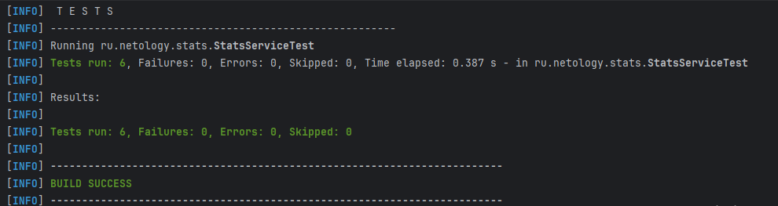

# Программа на вычисления с использованием массива данных на входе, с проверкой автотестами

# Входные данные:

* массив с данными о продажах за 12 месяцев
* необходимо написать 6 методов с тестами на них:
1. Сумма всех продаж
1. Средние продажи за 12 месяцев
1. Месяц с максимальными продажами
2. Месяц с минимальными продажами
3. Число месяцев с продажами выше среднего значения
4. Число месяцев с продажами ниже среднего значения

# Выходные данные:

* методы созданы и проверены автотестами
* проведено 6 тестов, 0 ошибок
* успешная сборка

mvn clean test

